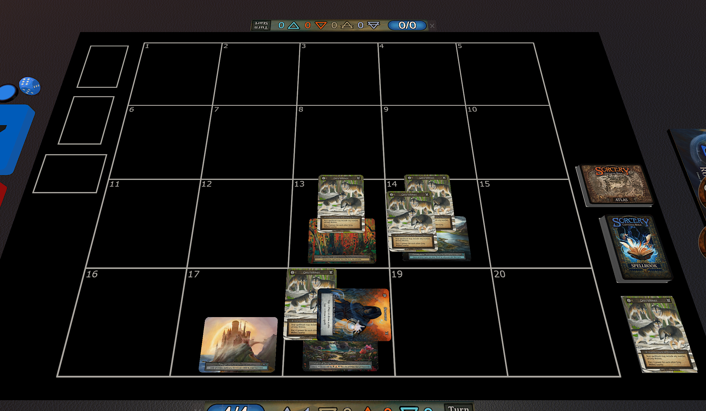

## Sorcery: Contested Realm TTS Custom Black Playmat!



### How do I install this?

1. Locate the TTS `Mods/Images` asset folder.
2. Place [this black playmat image](httpsd27a44hjr9gen3cloudfrontnetassetsttsplaymatsartplaymatjpg.jpg) into this directory (do not change the file name).

### Where is the TTS Images folder?

#### MacOS
The folder is *usually* in `/Users/<YourUsername>/Library/Tabletop Simulator/Mods/Images`

Open Terminal and enter:
```
cd ~/Library/Tabletop\ Simulator/Mods/Images && open .
```

#### Windows

The folder is *usually* in `C:\Users\<YourUsername>\Documents\My Games\Tabletop Simulator\Mods\Images`

Do some Windows stuff to find it, is File Explorer still a thing?

### How can I create my own playmat?

I used the free [image editor GIMP](https://www.gimp.org/downloads/).

1. Download and install GIMP, then open the [.xcf file](files/layer_file.xcf).
1. Replace the `background` layer with any image you would like.
1. `Export As` with the filename:
    *  `httpsd27a44hjr9gen3cloudfrontnetassetsttsplaymatsartplaymatjpg.jpg`

### BONUS FILE

If you would also like to replace the pixelated background with a simple blue color, you can add [this image](httpsd27a44hjr9gen3cloudfrontnetassetsttsskyboxartskyboxjpg.jpg) into the same TTS directory.  A backup of the original is provided [here](files/BACKUP_httpsd27a44hjr9gen3cloudfrontnetassetsttsskyboxartskyboxjpg.jpg).

### Anything else?

* Only you will see the custom playmat, your opponent will continue to see the default image.
* A [backup of the original](files/BACKUP_httpsd27a44hjr9gen3cloudfrontnetassetsttsplaymatsartplaymatjpg.jpg) is provided, just in case.  Rename it and remove `BACKUP_` from the filename and place it in `Images`.
* If the playmat has a red tint, it is due to TTS's ambient lighting. At the top of TTS go to `Options -> Lighting` then choose `Gradient`.
* Future Sorcery TTS Mod updates may break this. The filename will be updated here if that happens.
* Check out the [Four Cores](https://fourcores.xyz/install) app for all your Sorcery needs!